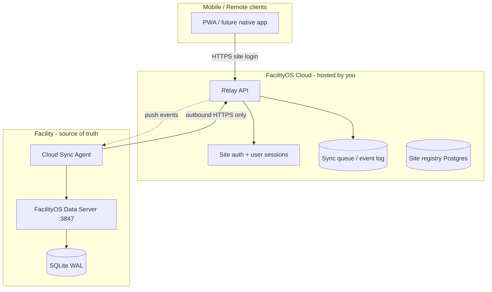

# FacilityOS Cloud — hosted relay (future resale tier)

Optional **FacilityOS Cloud** for customers who cannot run VPN tunnels or expose their facility network. On-prem remains the **source of truth** for compliance data; the cloud is a **read/write relay**, not a replacement database.

## Who this is for

| Customer | Today | With Cloud tier |
|----------|-------|-----------------|
| Single aquatic centre, IT-capable | Electron + LAN + optional tunnel | Same (no cloud needed) |
| Council / trust, no IT for tunnels | Struggles with remote managers | Cloud relay + mobile login |
| Multi-site reseller | Per-site licence + on-prem | Central reseller portal + per-site agents |

## Design principles

1. **On-prem authoritative** — SQLite at the facility wins on conflict for operational records (tests, closures, audits).
2. **Cloud is optional** — product works fully offline/on-LAN without cloud; cloud is a paid add-on.
3. **Same channel API** — mobile and desktop still call `dbQuery(channel, args)`; only the transport URL changes.
4. **Reseller-ready** — sites, plans, and module entitlements tie into existing `entitlements.js` + licence issuer.
5. **Compliance-safe** — audit log replicated; backups stay on-prem; cloud holds encrypted sync cache with retention policy.

---

## Architecture



### Components

| Component | Runs on | Role |
|-----------|---------|------|
| **Data server** | Facility PC | Existing Express + SQLite (unchanged) |
| **Cloud sync agent** | Same PC or Windows service | Pulls/pushes sync events; never opens inbound ports |
| **Relay API** | Your cloud (Azure/Fly.io/etc.) | Routes mobile queries to site queue; authenticates sites |
| **Cloud web UI** | CDN / same relay | Optional hosted PWA at `app.facilityos.nz` |
| **Reseller portal** | Cloud | Provision sites, licences, module maps |

---

## Sync model (on-prem wins)

### Event log (recommended v1)

On-prem appends rows to `cloud_sync_outbox` for mutating operations. Agent batches events to relay.

```
┌─────────────┐     batch POST      ┌─────────────┐
│ sync_outbox │ ──────────────────► │ relay ingest│
│ (SQLite)    │ ◄──────────────── │ ack + cursor│
└─────────────┘     pull pending    └─────────────┘
```

**Conflict rule:** events carry `site_id`, `entity_type`, `entity_id`, `updated_at`, `payload`. If relay has newer `updated_at` from another terminal on same site, on-prem merge policy:

- **Tests, closures, steam checks, work orders** — last-write-wins per `entity_id`, but on-prem agent rejects cloud overwrite if local `updated_at` is newer (facility wins).
- **Settings, licence** — on-prem only (never accepted from cloud down).
- **Deletes** — tombstone events with `deleted_at`.

### What syncs vs stays local

| Data | Sync to cloud | Notes |
|------|---------------|-------|
| Water tests | Yes | Mobile manager read + optional field entry |
| Steam checks | Yes | |
| Work orders / schedules | Yes | Manager alerts |
| Staff names (not PINs) | Yes | PIN auth stays on-prem hash only |
| Licence / billing | No | Issuer + on-prem licence row |
| Backups / audit raw DB | No | Audit *events* sync, not full DB file |
| Remote access token | No | Replaced by cloud site login |

### Mobile write path (cloud mode)

```
Mobile → POST relay.app/api/sites/{siteId}/query
       → relay validates user session + module licence
       → queues command OR forwards to connected agent (WebSocket)
       → agent executes dbQuery locally
       → result returned + outbox event confirmed
```

If agent offline: queue command with TTL; show “facility offline” on mobile for writes (reads may serve cached snapshot — policy choice).

---

## Security

| Layer | Mechanism |
|-------|-----------|
| Site registration | One-time pairing code generated on-prem → `cloud:pair` |
| Agent auth | Site `agent_key` (rotatable), mTLS optional in v2 |
| Mobile auth | Email/password or magic link + site membership; optional SSO later |
| Transport | TLS 1.2+ only |
| Data at rest | Encrypt relay queue per site (AES-256, KMS-managed keys) |
| Module enforcement | Relay checks plan/module map (copy of `entitlements.js` rules server-side) |

**Never** store staff PINs or remote access tokens in cloud.

---

## Licensing & resale packaging

Extend plans in `shared/db/entitlements.js`:

| Plan | On-prem | Cloud relay | Mobile anywhere |
|------|---------|-------------|-----------------|
| Standard | ✓ | — | LAN only |
| Professional | ✓ | — | LAN + tunnel |
| **Cloud** (new) | ✓ | ✓ | ✓ included |
| Enterprise | ✓ | ✓ | ✓ + multi-site portal |

Licence issuer adds:

- `cloud_enabled: true`
- `cloud_site_slug` (e.g. `eanc`)
- `max_cloud_users`

Reseller workflow:

1. Issue licence with Cloud tier.
2. Customer pairs site in **Settings → Cloud**.
3. You enable relay hostname `eanc.app.facilityos.nz` (or custom domain add-on).

---

## Implementation phases

### Phase 0 — Foundation (in repo now)

- [x] Channel API abstraction (`dbQuery`) — transport-swappable
- [x] Licence + module entitlements (+ `cloud` plan label)
- [x] Audit log
- [x] Remote access token model
- [x] PWA + mobile shell
- [x] `cloud_sync_outbox` schema + Settings UI

### Phase 1 — Site agent + minimal relay ✅ (this release)

- [x] **Relay API** (`npm run cloud:relay`) — pairing, push, heartbeat, snapshot
- [x] **Sync agent** (`npm run cloud:agent`) — outbound push from outbox
- [x] **Pairing flow** — Settings → Cloud → generate code → pair
- [x] **Auto-enqueue** — water tests + steam checks → outbox when cloud enabled
- [x] **`npm run cloud:dev`** — server + relay + agent for local testing
- [ ] Windows service installer for agent (use Task Scheduler / NSSM for now)

Runbook: [cloud/README.md](cloud/README.md)

### Phase 2 — Mobile via cloud ✅ (scaffold in repo)

- [x] Hosted PWA cloud login (`VITE_CLOUD_RELAY_URL` + `CloudLogin`)
- [x] Site-scoped user login (`POST /api/sites/:siteId/auth/login`)
- [x] Read-only manager dashboard from relay cache (`GET /manager-dashboard`)
- [x] Create mobile users from Settings → Cloud (agent-authenticated)
- [x] Web Push scaffold on non-compliant test ingest (requires VAPID keys)
- [ ] Hosted PWA at `app.facilityos.nz` (deploy `dist/` to your CDN)
- [ ] `POST /api/sites/{siteId}/query` write path via agent (Phase 3)

### Phase 3 — Writes + offline queue

- Mobile test entry through relay → agent → SQLite
- Native push via Capacitor + relay (see [CAPACITOR.md](CAPACITOR.md))

### Phase 4 — Reseller portal

- Multi-site dashboard, licence issuance API, usage metering

---

## On-prem hooks (scaffold)

Settings keys (migration `005_cloud_sync.sql`):

| Key | Purpose |
|-----|---------|
| `cloud_enabled` | `0` / `1` |
| `cloud_site_id` | UUID from relay registration |
| `cloud_agent_key` | Secret for agent (stored hashed) |
| `cloud_relay_url` | e.g. `https://relay.facilityos.nz` |
| `cloud_last_sync_at` | ISO timestamp |
| `cloud_pairing_code` | Temporary code for registration |

API channels (local admin, LAN only):

| Channel | Purpose |
|---------|---------|
| `cloud:status` | Connection state for Settings UI |
| `cloud:configure` | Save relay URL + enable flag |
| `cloud:pair` | Exchange pairing code for site_id + agent_key |
| `cloud:sync_now` | Trigger agent sync (no-op until agent shipped) |

See `shared/cloud/syncProtocol.js` for event envelope format shared between agent and relay.

---

## Comparison: tunnel vs cloud

| | DIY tunnel (today) | FacilityOS Cloud |
|--|-------------------|------------------|
| Customer IT | Must set up Cloudflare/Tailscale | None |
| Inbound ports | None (outbound tunnel) | None (agent outbound) |
| You operate | No | Yes (relay SLA) |
| Recurring revenue | Licence only | Licence + cloud subscription |
| Data location | 100% on-prem | Operational cache on cloud; master on-prem |
| Offline facility | LAN still works | LAN works; cloud mobile degraded |

---

## Open decisions (for product sign-off)

1. **Read cache TTL** when agent offline — 15 min vs 24 h?
2. **PII in cloud** — staff email/phone in sync payload or redacted?
3. **Region** — AU/NZ data residency requirement for relay?
4. **Pricing** — per-site/month vs per-active-user?

---

## Related docs

- [REMOTE_ACCESS.md](REMOTE_ACCESS.md) — tunnel + token (Professional tier, no cloud ops)
- [MOBILE.md](MOBILE.md) — PWA, LAN, steam tablet
- Enhancement prompts — `FacilityOS_Cursor_Prompts_v2.md` (on-prem feature baseline)
